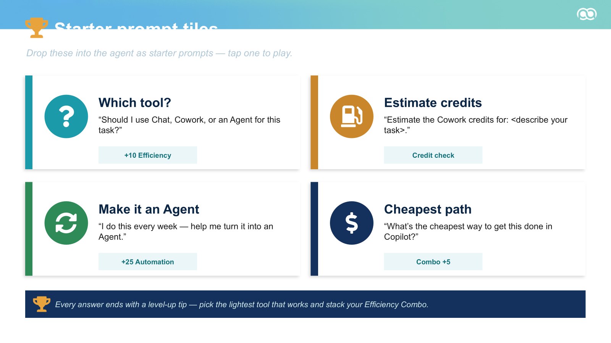

# 🏆 Route It!

**Route It!** is a friendly, game-show-style Microsoft 365 Copilot agent that helps people choose the lowest-cost, best-fit way to complete a task:

- 💬 **Copilot Chat** for a quick, one-session answer
- 🤝 **Copilot Cowork** for a one-off, multi-step job across apps
- 🧠 **Agent Builder** for repeatable work or a helper others will reuse

The guiding principle is simple:

> Recommend the lightest tool that fully does the job.

## What it does

For every task, Route It!:

1. Scores five decision signals.
2. Recommends Chat, Cowork, or an Agent.
3. Explains the choice in plain language.
4. Gives a practical 3–6 step implementation path.
5. Estimates Cowork credits when Cowork is recommended.
6. Produces an Agent Builder implementation plan when recurring work should become an agent.
7. Rewards efficient choices with a light game-show scoring system.

## Decision shortcut

| Task shape | Route |
|---|---|
| One question or one draft | 💬 Copilot Chat |
| One multi-step job across apps | 🤝 Copilot Cowork |
| The same shaped job repeatedly | 🧠 Agent Builder |

## Repository contents

| Path | Purpose |
|---|---|
| [`agent/instructions.md`](agent/instructions.md) | Ready-to-paste Agent Builder instructions |
| [`agent/starter-prompts.md`](agent/starter-prompts.md) | Suggested starter prompts |
| [`agent/description.md`](agent/description.md) | Agent name, description, and setup fields |
| [`docs/agent-builder-setup.md`](docs/agent-builder-setup.md) | Step-by-step setup instructions |
| [`docs/decision-guide.md`](docs/decision-guide.md) | Human-readable routing logic |
| [`docs/credit-estimator.md`](docs/credit-estimator.md) | Planning rubric and limitations |

## Build it in Agent Builder

1. Open **Microsoft 365 Copilot** and create a new agent with **Agent Builder**.
2. Name it **Route It!**
3. Paste the description from [`agent/description.md`](agent/description.md).
4. Paste [`agent/instructions.md`](agent/instructions.md) into the agent instructions.
5. Add the prompts from [`agent/starter-prompts.md`](agent/starter-prompts.md).
6. Test with quick, multi-app, recurring, and ambiguous tasks.
7. Publish it for yourself or your intended Microsoft 365 audience.

See the complete [Agent Builder setup guide](docs/agent-builder-setup.md).

## Starter prompts

- **Which tool?** — “Should I use Chat, Cowork, or an Agent for this task?”
- **Estimate credits** — “Estimate the Cowork credits for: `<describe your task>`.”
- **Make it an Agent** — “I do this every week—help me turn it into an Agent.”
- **Cheapest path** — “What’s the cheapest way to get this done in Copilot?”

## Pricing note

Cowork is usage-based and funded with Copilot Credits. Microsoft currently lists pay-as-you-go credits at **$0.01 USD per credit**, while prepaid plans can offer lower per-credit cost. Route It!’s cost bands are a transparent planning heuristic—not a Microsoft billing quote.

For authoritative information, see:

- [Copilot Cowork overview](https://learn.microsoft.com/en-us/microsoft-365/copilot/cowork/)
- [Cowork common questions](https://learn.microsoft.com/en-us/microsoft-365/copilot/cowork/cowork-faq)
- [Usage-based billing and Copilot Credits](https://learn.microsoft.com/en-us/microsoft-365/copilot/usage-based-billing-overview-copilot-credits)
- [Manage Copilot Credits](https://learn.microsoft.com/en-us/microsoft-365/copilot/usage-based-billing-manage-copilot-credits)
- [Microsoft Cowork adoption guidance](https://adoption.microsoft.com/en-us/copilot/cowork/ai-user/)

## Important limitations

- Product capabilities, licensing, and pricing can change.
- Credit estimates are directional and must always be labeled as estimates.
- Sensitive or regulated actions require appropriate human review and organizational controls.
- Route It! does not replace Microsoft documentation, tenant policy, legal review, or financial approval.

## License

Released under the [MIT License](LICENSE).
